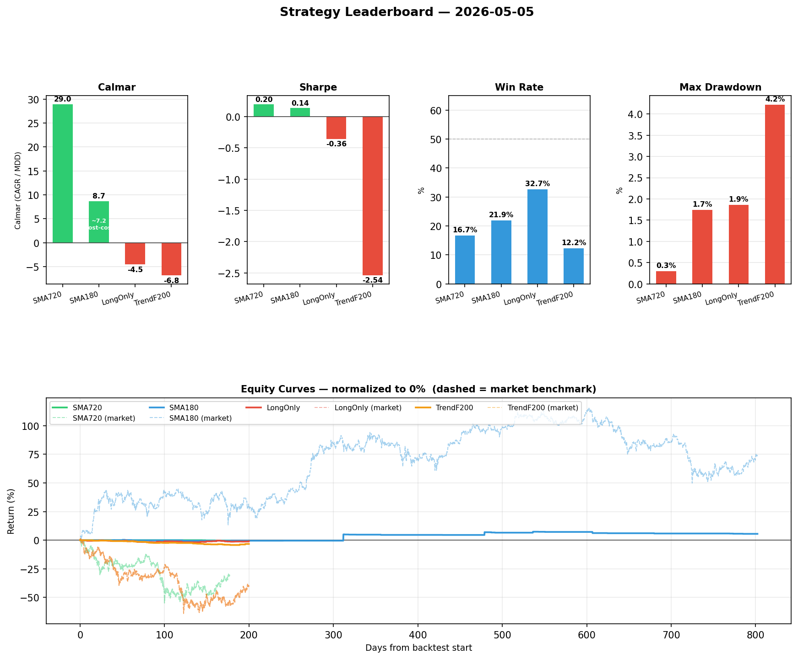

# Crypto Strategy Backtesting

Freqtrade backtesting setup targeting Hyperliquid perpetual futures (USDC-quoted).
Full docs, research log, and decisions: [wiki/_index.md](wiki/_index.md).

## Strategy Leaderboard



Metrics: Calmar (CAGR/MDD), Sharpe, Win Rate, Max Drawdown — all closed-trade.
SmaRegime180 Calmar bar shows the post-all-costs estimate (~7.2, taker fees + historical funding) annotated inside.
Equity curves are normalized to 0% at backtest start; dashed lines are the market benchmark for each window.

Full table, footnotes, and cost breakdown: [wiki/_index.md → Strategy Leaderboard](wiki/_index.md#strategy-leaderboard).

Regenerate chart:

```shell
./freqtrade/.venv/bin/python scripts/generate_leaderboard_chart.py
```

## Quick Start

See [wiki/_index.md → Setup](wiki/_index.md#setup-first-run-on-this-machine) for environment setup and backtest commands.
