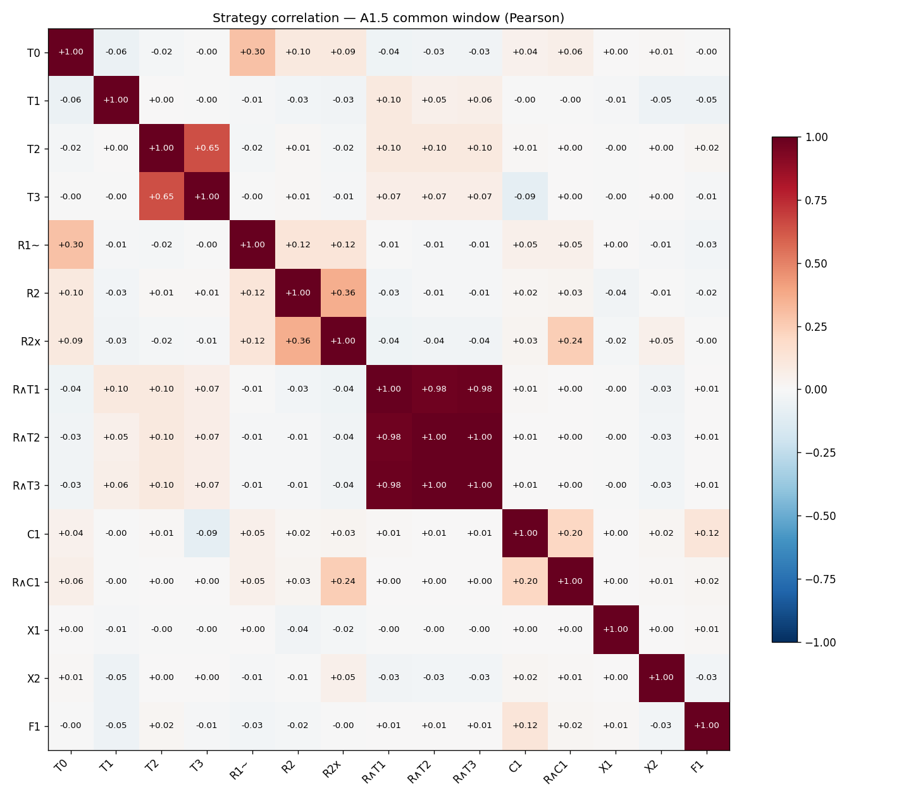

# Backtesting Wiki

Crypto strategy backtesting setup built on [Freqtrade](https://www.freqtrade.io/en/stable/), targeting Hyperliquid (USDC-quoted) markets. Revived 2026-04 as a possible base for actively trading personal crypto holdings.

**Last updated:** 2026-05-16 (evaluation + diversity buildout sprint)

**Current state:** Full A1 → D2 sprint completed in one session per `decisions/005-evaluation-and-diversity-plan.md`. New evaluation tooling (`scripts/eval_layers.py`) adds Layer-5 metrics (Ulcer, Martin, skew, kurtosis, tail ratio, CVaR-5%) + correlation matrix + 3-flavor MDB. Every strategy re-backtested on Binance common window 2020-09 → 2026-05 (5.5y, 2 bulls + 2 bears, 5-coin universe BTC/ETH/SOL/AVAX/DOGE). Three new strategy families opened: X1 pairs (killed — cointegration absent on crypto majors; two-leg v2 on 2026-05-16 strengthens the verdict and surfaces a Freqtrade framework limit on atomic pair execution), X2 cross-sectional momentum (▲ marginal frontier), F1 funding MR (killed by K1-fmr). **Candidate book is now {T3, R∧T2}** — SmaRegime180 (BTC 4h, conservative) + HmmSmaSlopeV2 (5-coin 4h, high return); correlation 0.07, MDB-rp +0.55 robust against {T3} alone. R∧T1/V2/V3 are statistically one strategy (Pearson 0.96-1.00). Internal writeup at `../writeup-2026-05-16.md`. Paper deferred per `decisions/010-paper-plan-deferred.md` until forward held-out window runs.

**Earlier 2026-05-10 experiments:** (1) **Rolling-window HMM refit** (`HmmRegime4Rolling`) on BTC: SQN 0.59 (vs look-ahead's 1.38), win rate 37.7%, return +1.15%. **Look-ahead absorbed ~50% of the alpha**; demotes HmmRegime4 to upper-bound. (2) **Multi-asset HmmRegime4Rolling** on 7 majors: −5.62%, only HYPE/BTC profitable. HMM does not generalise without per-coin tuning. (3) **FundingCarry** threshold-gated long-only on 7 majors: catastrophic −30.16%, all losers stopped at −10%. Naive carry fails in bear. (4) **HmmCarry conjunction** (HMM bull AND funding-negative) on 7 majors: −19.59%, MDD 23.86%. **Worse than HMM alone** — signals are anti-complementary, not independent (HMM is reactive, funding is forward-looking; intersection picks worst moments). Only HYPE/ETH showed expected tightening; BTC win rate collapsed 41.1% → 7.7%. Open items: (1) Reverse-sign HmmCarry (positive funding as bull confirmation); (2) Per-coin funding-sign learning; (3) Lead-lag conjunction (funding-negative *before* HMM-bull turns on); (4) Per-coin HMM hyperparameter sweep with DSR gate; (5) Bull-window CEX backtest as training-set check.

---

## Contents

- [learnings.md](learnings.md) — confirmed facts, open hypotheses, ruled-out directions, search priorities
- `reference/`
  - [strategy-archetypes.md](reference/strategy-archetypes.md) — canonical reference: 7 strategy archetypes from IMC Prosperity podium writeups, annotated with current project state. Stable reference; findings live in `results/` and `learnings.md`.
  - [strategy-taxonomy.md](reference/strategy-taxonomy.md) — project-specific family map: every strategy we've built, grouped by signal source (T/R/C) with status tags (★/▲/~/✗). Read this when names get confusing.
- `decisions/`
  - [001-drop-external-data-repo.md](decisions/001-drop-external-data-repo.md) — removed the `freqtrade_hyperliquid_download-data` gitlink
  - [002-hyperliquid-deep-history.md](decisions/002-hyperliquid-deep-history.md) — accept the 5000-candle API cap; reconstruct from S3 only if needed
  - [003-baseline-eval.md](decisions/003-baseline-eval.md) — baseline used by `scripts/run_eval.sh` and the Session Start Routine
  - [004-kill-criteria-sma-regime-180.md](decisions/004-kill-criteria-sma-regime-180.md) — pre-registered hard-kill thresholds + continuous-shrinkage formula for SmaRegime180
  - [009-portfolio-aware-k1.md](decisions/009-portfolio-aware-k1.md) — codifies the portfolio-aware K1 exception used to admit R∧T2 (standalone MDD breach OK iff combined-book MDD ≤ 5.5% AND MDB-rp ≥ 0.30 robust AND corr < 0.85, with 11% hard cap)
- `experiments/` — backtest runs and results
- `results/` — per-strategy report cards (one file per run)
- `papers/` — summaries of relevant research (populated by the weekly paper-search agent)
- `logs/` — weekly paper-search run logs
- `agent-config/paper-search-trigger.md` — master prompt for the weekly paper-search RemoteTrigger

---

## Papers

Research summaries added by the weekly paper-search agent. Sorted newest-first. Primary sort: direct applicability to Freqtrade strategy on Hyperliquid perps.

| Paper | Venue | Date | Priority addressed | File |
|-------|-------|------|--------------------|------|
| Funding-Aware Optimal Market Making for Perpetual DEXs | arXiv 2605.06405 | May 2026 | P1 — Carry window duration (OU half-life ~8h on Hyperliquid ETH/BTC/SOL) | [funding-aware-market-making-perp-dex-2026.md](papers/funding-aware-market-making-perp-dex-2026.md) |
| Slippage-at-Risk (SaR): A Forward-Looking Liquidity Risk Framework for Perpetual Futures Exchanges | arXiv 2603.09164 | Mar 2026 | P3 — Slippage on Hyperliquid (real order-book data) | [slippage-at-risk-hyperliquid-2026.md](papers/slippage-at-risk-hyperliquid-2026.md) |
| Evaluating Structured Strategy Backtests: Peer Benchmarks, Regime Timing, and Live Performance | arXiv 2604.18821 | Apr 2026 | P3 — Backtest-vs-live divergence | [backtest-regime-timing-live-performance-2026.md](papers/backtest-regime-timing-live-performance-2026.md) |
| Markov and HMM for Regime Detection in Cryptocurrency Markets: Evidence from Bitcoin (2024–2026) | Preprints.org 202603.0831 | Mar 2026 | P2 — Regime detection (crypto-specific HMM) | [hmm-regime-detection-bitcoin-2026.md](papers/hmm-regime-detection-bitcoin-2026.md) |
| Explainable Regime Aware Investing | arXiv 2603.04441 | Mar 2026 | P2 — Regime detection | [wasserstein-hmm-regime-investing-2026.md](papers/wasserstein-hmm-regime-investing-2026.md) |
| Who Sets the Range? Funding Mechanics and 4h Context in Crypto Markets | arXiv 2601.06084 | Dec 2025 | P1+P2+P4 — Carry timing + HMM covariate + mean-reversion trigger | [funding-mechanics-4h-context-crypto-2026.md](papers/funding-mechanics-4h-context-crypto-2026.md) |
| The Two-Tiered Structure of Cryptocurrency Funding Rate Markets | MDPI Mathematics 14(2):346 | Jan 2026 | P1+P3 — Funding rate carry + execution costs | [two-tiered-funding-rate-markets-2026.md](papers/two-tiered-funding-rate-markets-2026.md) |
| Trends and Reversion in Financial Markets on Time Scales from Minutes to Decades | arXiv 2501.16772 | Jan 2025 | P4 — Mean-reversion boundary at 1h–4h | [trends-reversion-timescale-2025.md](papers/trends-reversion-timescale-2025.md) |
| Exploring Risk and Return Profiles of Funding Rate Arbitrage on CEX and DEX | Blockchain: Research and Applications (Elsevier) | Aug 2025 | P1 — DEX carry return profile | [dex-carry-funding-rate-arbitrage-2025.md](papers/dex-carry-funding-rate-arbitrage-2025.md) |
| Predictability of Funding Rates | SSRN 5576424 | Oct 2025 | P1 — Funding rate carry signal | [funding-rate-predictability-inan-2025.md](papers/funding-rate-predictability-inan-2025.md) |

---

## Strategy Leaderboard

Primary sort: **Calmar (closed trades)**. Co-primary: **SQN** (System Quality Number — penalises thin samples; use this when N<30). All metrics are closed-trade unless noted. See `wiki/decisions/003-baseline-eval.md` for the evaluation baseline. CT = closed trades.

| Strategy | Calmar (CT) | SQN | PF | Sharpe (CT) | CAGR | MDD | Ulcer⁷ | Trades | Data | Report |
|---|---:|---:|---:|---:|---:|---:|---:|---:|---|---|
| `SmaRegime720` (1h SMA720 + slope gate) | **28.96**² | 0.69 | 3.68 | 0.20 | +1.66% | 0.30% | — | 6 | BTC 1h, bear, 2025-10-29→2026-04-24 | [2026-04-30](results/2026-04-30-sma-regime-720.md) |
| `HmmRegime4` (look-ahead, 4-state GaussianHMM, 1h) | 26.35⁴ | 1.38⁴ | 1.58 | 1.23 | +5.26% | 1.03% | — | 74 | BTC 1h, bear, 2025-11-04→2026-05-09 | [2026-05-09](results/2026-05-09-hmm-regime-4.md) |
| `HmmRegime4Rolling` (walk-forward refit, 1h) | 12.11 | 0.59 | 1.31 | 0.51 | +2.56% | 1.10% | — | 53 | BTC 1h, bear, 2025-11-25→2026-05-09 | [2026-05-10](results/2026-05-10-hmm-regime-4-rolling.md) |
| `SmaRegime180` (4h SMA180 + slope gate) | **8.68**³ | 1.02 | 2.72 | 0.14 | +2.83% | 1.74% | — | 32 | BTC 4h, full, 2024-02-12→2026-04-24 | [2026-04-30](results/2026-04-30-sma-regime-180.md) |
| `SmaRegime180` cross-cycle (Binance perp)⁶ | **7.23** | **1.73** | 2.85 | 0.13 | +2.84% | 2.22% | — | 92 | BTC 4h, 2019-10→2026-05 | [2026-05-10](results/2026-05-10-sma-regime-180-cex-bull-validation.md) |
| `LongOnlyStrategy` (placeholder SMA cross) | -4.55 | -0.53 | 0.81 | -0.36 | -1.61% | 1.86% | — | 49 | BTC 1h, bear, 2025-10-06→2026-04-24 | — |
| `TrendFilter200` (1h SMA200 regime filter) | -6.84 | -2.79 | 0.43 | -2.54 | -5.44% | 4.22% | — | 90 | BTC 1h, bear, 2025-10-06→2026-04-24 | [2026-04-24](results/2026-04-24-trend-filter-200.md) |
| `HmmRegime4Rolling` 7-asset portfolio | -4.43 | -0.59 | 0.91 | -1.53 | -12.02% | 14.70% | — | 504 | 7 majors 1h, bear, 2025-11-25→2026-05-09 | [2026-05-10](results/2026-05-10-hmm-regime-4-multi-asset.md) |
| `FundingCarry` 7-asset portfolio | -7.35 | -3.60 | 0.28 | -2.57 | — | 42.14% | — | 47 | 7 majors 1h, bear, 2025-11-04→2026-05-09 | [2026-05-10](results/2026-05-10-funding-carry.md) |
| `HmmCarry` (conjunction) 7-asset portfolio⁵ | -9.51 | — | 0.55 | -2.09 | — | 23.86% | — | 278 | 7 majors 1h, bear, 2025-11-25→2026-05-09 | [2026-05-10](results/2026-05-10-hmm-carry-conjunction.md) |

² Calmar unreliable at N=6 (SQN 0.69). SmaRegime180 (N=32, SQN 1.02) is the more meaningful data point for this family.

³ Uses ccxt default 0.045%/side fee (not zero-fee as previously documented). Actual Hyperliquid taker (0.035%/side): Calmar 8.86 (+6.39%). Post-all-costs (taker + historical funding): est. Calmar ~7.2 (+5.18%). See [2026-04-30 result card](results/2026-04-30-sma-regime-180.md) for full breakdown.

⁴ Calmar inflated by tiny MDD denominator (1.03%). **Look-ahead, upper-bound only.** Honest walk-forward version (`HmmRegime4Rolling`, SQN 0.59) is the comparable number — look-ahead absorbed ~50% of the alpha (return +2.65% → +1.15%, win rate 45.9% → 37.7%). HmmRegime4Rolling is the row to rank against SmaRegime180 (SQN 0.59 vs 1.02 — SmaRegime180 wins on co-primary). Multi-asset run on 7 majors is decisively negative (−5.62%) — HMM does not generalise without per-coin tuning.

⁵ Conjunction of HmmRegime4Rolling (bull_prob > 0.65) and FundingCarry (funding_roll < threshold). Hypothesis: independent signals → tighter filter. Result: signals are anti-complementary in this window — conjunction is *worse* than HMM alone (−19.59% vs −5.62%). HMM is reactive; funding is forward-looking; intersection picks late-cycle bull lag with early-cycle bear lead. Only HYPE/ETH showed expected tightening; BTC win rate collapsed 41.1% → 7.7%. See result card for reverse-sign and per-coin follow-ups.

⁷ **Ulcer Index** = sqrt(mean(drawdown_pct²)) along the wallet curve. Path-aware companion to MDD — captures *how long* underwater, not just *how deep*. Lower = better. Backfill populated during phase A1.5 re-backtests (per decision 005). Layer-5 tables already added to 6 result cards from `dsr_analysis.py:46-56` runs.

⁶ Cross-cycle out-of-sample validation. 6.7y of Binance BTC perp 4h covering 2 bull + 2 bear cycles. Sub-window decomposition: 2020-21 bull Calmar 14.04, 2022 bear Calmar −5.23 (PF 0.00 but MDD 0.28% — strategy correctly stays flat), 2023-24 bull Calmar 21.13, 2025 bear Calmar 3.59. Win rate 21.7% identical to Hyperliquid (21.9%). **SmaRegime180 graduates to paper-trade candidate** under decisions/004 kill criteria. Worst regime is 2022-style deep bear: PF goes to 0 but slope-gate filter caps DD at 0.28%. Continuous-shrinkage formula would have shrunk size to ~10% through 2022 without hard-killing.

**H7 status (updated 2026-05-10):** `SmaRegime180` passes the cross-cycle validation on Binance perp 2019-26. Calmar 7.23 (close to Hyperliquid 8.68), win rate 21.7% (vs 21.9%), bull-window Calmars 14.04 and 21.13, 2022 bear is contained-failure (Calmar −5.23 but MDD 0.28%). H7 inflation is real but bounded — strategy is regime-flattered by ~20% on the original Hyperliquid window, not collapsing. Slope-gate family validated across 4 regime transitions.

**Fee correction (2026-05-03):** The original 6.33% run was NOT zero-fee — Freqtrade applied ccxt's hardcoded Hyperliquid default (0.045%/side). True zero-fee baseline is 6.62% (Calmar 9.50). Actual Hyperliquid taker (0.035%/side, via `--fee` CLI flag) gives 6.39% (Calmar 8.86). The `"fee"` key in config.json exchange block is silently ignored by the backtester.

**Cost modeling complete (2026-05-03):** Historical funding rates applied per-trade (19,733 periods). Total cost: −2.25 USDC taker + −12.08 USDC funding = −14.33 USDC on 66.16 USDC gross = 21.7% drag. Net post-all-costs: +51.83 USDC (+5.18%), estimated Calmar ~7.2. Funding is 5.4× larger than taker fees and adversely selected: 85% of funding drag falls on the 7 winning trades (avg hold 25.9d) during bull-run periods. Strategy survives realistic cost modeling.

**Benchmark:** market change -37.20% (bear window), +61.43% (full 4h window). Long-only trend strategies will underperform buy-and-hold in strong bulls — evaluate on risk-adjusted return (Calmar, SQN), not absolute return.

Rows added here whenever a new strategy is backtested. Link the Report column to the relevant `wiki/results/<date>-<strategy>.md` file.

---

## Common-Window Leaderboard (A1.5, 2026-05-16)

Every strategy re-backtested on Binance perp **2020-09-23 → 2026-05-09 (5.5y, 2 bulls + 2 bears)**, fees `--fee 0.00035`, common evaluation substrate per `decisions/005`. Multi-asset rows use 5-coin universe (BTC/ETH/SOL/AVAX/DOGE). Carry strategies use `CARRY_FUNDING_EXCHANGE=binance`; **as of 2026-05-16 funding parquets cover the full 5.5y window** for all 5 coins (~6165–6240 rows each — see footnote ²⁰). Earlier rows for `HmmCarry` and `HmmCarryReverse` still ran against the truncated 2.3y-active parquet and are not yet re-backtested.

Sort: **Calmar descending**. Highlighted = top candidates by family.

**Book composition: {T3, R∧T2}** (both ★). MDB-rp computed against this book — values change when book composition changes.

| Code | Strategy | Data | Calmar | SQN | MDD% | Ulcer | Martin | corr→T3 | MDB-rp¹⁴ | Robust¹¹ | Status |
|---|---|---|---:|---:|---:|---:|---:|---:|---:|:---:|:---:|
| **T3** | SmaRegime180 | BTC 4h | **8.76** | 1.78 | **2.21%** | **1.30** | +2.51 | (book) | (book) | (book) | **★** |
| **R∧T2** | HmmSmaSlopeV2 | 5coin 4h | **30.23** | 2.73 | 6.05%⁸ | 2.87 | **+7.41** | (book) | (book) | (book) | **★** |
| R∧T3 | HmmSmaSlopeV3 | 5coin 4h | 27.28 | 2.79 | 6.91% | 3.30 | +6.58 | +0.07 | −0.023 | no | ▲¹² |
| R∧T1 | HmmSmaSlope | 5coin 4h | 25.01 | 2.97 | 8.21% | 3.82 | +6.00 | +0.07 | +0.012 | no | ▲¹² |
| R1~ | HmmRegime4 (look-ahead) | BTC 1h | 9.16⁹ | 3.88 | 2.94% | 1.09 | +4.24 | +0.00 | +0.07 | YES | ~ |
| T2 | SmaRegime720 | BTC 1h | 5.39 | 1.74 | 3.57% | 1.75 | +1.82 | +0.65 | −0.023 | no | ▲ |
| T1 | TrendFilter200 | BTC 1h | 1.69 | 1.10 | 8.54% | 3.79 | +0.67 | −0.00 | +0.040 | YES | ▲ |
| **X2** | CrossSectionalMomentum | 5coin 4h | — | — | 13.04% | — | — | +0.00 | +0.048 | YES | ▲¹⁵ |
| R2x | HmmRegime4Rolling 5-coin | 5coin 1h | 3.79 | 1.66 | 21.47% | 10.25 | +1.15 | −0.01 | +0.069 | YES | ✗¹³ |
| R2 | HmmRegime4Rolling | BTC 1h | 0.47 | 0.39 | 7.65% | 4.01 | +0.17 | +0.01 | +0.010 | YES¹⁶ | ✗ |
| **X1** | PairsZScore (SOL-DOGE, single-leg) | 4h | 2.08 | 0.95 | 4.03% | 0.48 | +0.55 | +0.00 | **−0.898** | no | ✗¹⁷ |
| **X1v2** | PairsZScoreV2 (SOL+DOGE, two-leg) | 4h | 0.97 | 0.42 | 2.91% | 0.82 | +0.65 | n/c | n/c | n/c | ✗²¹ |
| C1 | FundingCarry 5-coin²⁰ | 5coin 1h | 1.93 | 1.22 | 15.65% | 5.87 | +0.81 | n/c | n/c | n/c | ✗ |
| R∧C1 | HmmCarry 5-coin | 5coin 1h | 0.08 | 0.14 | 35.46% | 9.57 | +0.04 | +0.00 | −0.000 | no | ✗ |
| R∧C1ʳ | HmmCarryReverse 5-coin¹⁹ | 5coin 1h | 0.78 | 0.56 | 15.09% | 7.50 | +0.28 | n/c | n/c | n/c | ✗ |
| **F1** | FundingExtremeMR | 5coin 4h | −0.32 | −0.64 | 33.51% | 15.98 | −0.14 | n/c | n/c | n/c | ✗²⁰ |
| T0 | LongOnlyStrategy | BTC 1h | −0.37 | −0.58 | 10.17% | 6.26 | −0.11 | −0.00 | −0.009 | no | · |

⁸ **R∧T2's 6.05% MDD breaches K1 by 0.55pp BUT MDB-rp = +0.55 robust.** A2 correlation matrix resolved the question: R∧T2 is *portfolio-justified* — adding it to T3 increases portfolio Sharpe by 0.55 (robust across all 3 MDB schemes). Standalone MDD breach is real but contained; deploy at smaller size in a 2-strategy book. Recommend updating K1 in decision 004 to apply per-strategy with portfolio-aware exception: if MDB-rp > 0.3 robust, accept up to 8% MDD provided book is ≥2 strategies. (Open: write `decisions/009-kill-criteria-portfolio.md`.)

⁹ **R1 (HmmRegime4 look-ahead) is the unbeatable ceiling — not tradeable.** Listed for context only.

¹⁰ **Superseded by footnote ²⁰ on 2026-05-16.** Original note: FundingCarry 5-coin survives on Binance common window where it died on Hyperliquid bear (−30.16% → +2.13%); funding parquet only covered 2022-11 → 2025-02 of the 5.5y window, so most of the period the strategy was flat. Updated: full-window re-run gives +32.44% return / Calmar 1.93 / MDD 15.65% — real edge, but MDD kills it.

¹¹ **Robust** = MDB > 0 under all three weighting schemes (eq, rp, mv). See `wiki/methodology/correlation-and-mdb.md`. Strategies marked YES are robustly portfolio-additive vs the current book (T3 alone).

¹² R∧T1/V2/V3 collapse to one effective strategy under correlation: pairwise Pearson 0.98-1.00, Spearman 0.96-0.97. V2 chosen as ★ representative (best Calmar/MDD pair); V1/V3 demoted to ▲ research-frontier. Use V2 in any combined book.

¹³ R2x is robust-positive MDB-rp (+0.07) but standalone MDD 21.47% / Ulcer 10.25 is unacceptable. Could only be deployed at very small size; not a serious paper-trade candidate. Documented as research frontier point only.

¹⁴ **MDB-rp values changed** when the book expanded from {T3} to {T3, R∧T2}. R∧T1/V3 went from robust-positive to non-robust because they overlap entirely with R∧T2 (Pearson 0.96-1.00) — the second strategy already absorbs their signal. This is the methodology behaving correctly: each strategy is evaluated against what the book *currently* contains. Old MDB values vs book = {T3} alone preserved in `wiki/results/_correlation_table.json` v1 archive.

¹⁵ **X2 CrossSectionalMomentum**: standalone MDD 13.04% breaches K1-xs (12%) per `decisions/007-kill-criteria-cross-sectional.md`. MDB-rp +0.048 is robust-positive but below the 0.30 magnitude floor codified in `decisions/009-portfolio-aware-k1.md`. **Verdict (2026-05-16): X2 does NOT enter the candidate book.** Family stays on the leaderboard as ▲ frontier for diversity reference; a future X2 variant must clear both standalone MDD *and* MDB-rp ≥ 0.30. See decision 009 §6.

¹⁶ R2 has technically-robust MDB but values are vanishingly small (+0.010, +0.011, +0.012). Practical interpretation: this is statistical noise, not a real diversification signal. Kept ✗ status.

¹⁷ **X1 PairsZScore**: cointegration on crypto majors is essentially absent (preflight pass rate 7.4% for best pair SOL-DOGE; 1.3% for BTC-ETH). Strategy correctly stays mostly flat (10 trades over 5.6y) due to K2-pairs gate. Standalone +8.66% / MDD 4.03% looks fine but trade count is too low for DSR. **MDB-rp −0.898** because the very-low-vol strategy receives oversized risk-parity weight without enough return to justify it. Killed. Two-leg V2 (planned upgrade) might rescue this; deferred to follow-up sprint.

²⁰ **C1 & F1 full-window re-backtest (2026-05-16):** Binance funding parquets extended from 2.3y (2022-11 → 2025-02) to full 5.5y (2020-09-23 → 2026-05-09) for all 5 coins via `scripts/download_binance_funding.py --force`. Supersedes the 2.3y-truncated rows. New C1: +32.44% return / Calmar 1.93 / MDD 15.65% / SQN 1.22 / 957 trades — strategy is *genuinely positive standalone* but still fails K1 (MDD 2.85× threshold) and decision-009 portfolio exception (MDD > 11% hard cap). New F1: −11.60% return / Calmar −0.32 / MDD 33.51% / SQN −0.64 / 2582 trades — **stays killed**; extending the window confirms F1 is not an artefact of sparse data. MDB-rp not recomputed (book composition unchanged; both strategies still excluded). See [2026-05-16 funding-carry-fullwin](results/2026-05-16-funding-carry-fullwin.md) and [2026-05-16 funding-extreme-mr-fullwin](results/2026-05-16-funding-extreme-mr-fullwin.md).

¹⁹ **R∧C1ʳ (HmmCarryReverse, 2026-05-16)**: reverse-sign variant of HmmCarry — enter on HMM-bull AND funding-POSITIVE (longs paying = trend confirmation) instead of funding-negative. Sign flip is directionally correct: total return +12.67% vs HmmCarry's catastrophic MDD-35%, BTC win rate rehabilitated 7.7% → 35.9% (confirms 05-10 mechanism). But MDD 15.09% still ≫ K1 5.5% by 2.7×, Calmar 0.78 ≪ 2.0 walk-forward minimum. AVAX has opposite sign (−9.79%) — bull-funding doesn't confirm trend on AVAX. Funding-parquet truncation same as R∧C1 (2.3y of 5.5y window active). MDB-rp not computed (book composition unchanged). **Single-rule HMM × funding conjunction is killed in both sign directions**; only per-coin signed-funding remains as a live extension. See [2026-05-16](results/2026-05-16-hmm-carry-reverse.md).

¹⁸ **Superseded by footnote ²⁰ on 2026-05-16.** Original note: F1 FundingExtremeMR's counter-funding mean-reversion thesis failed on common window with MDD 29.94% (6× K1-fmr) on the 2.3y-active parquet. Updated: full-window re-run gives MDD 33.51% / Calmar −0.32 / SQN −0.64 over 2582 trades — confirms the kill (not a truncation artefact). Per-pair: BTC/ETH modestly positive, DOGE/AVAX/SOL decisively negative. Counter-funding-MR is the wrong sign on alts.

²¹ **X1v2 PairsZScoreV2 (two-leg, 2026-05-16):** native two-leg execution of the SOL–DOGE cointegration pair (both legs traded same-bar; equal-dollar sizing; shared z-score signal). Result: +3.04% / Calmar 0.97 / MDD 2.91% / SQN 0.42 / 13 trade-legs (5 SOL + 8 DOGE). **Two-leg confirms v1's kill** rather than rescuing it. Three findings: (a) SOL leg +9.94% with 80% win-rate is essentially directional alpha during the 2021 / late-2024 SOL runs — the "pairs" framing was incidental in v1; (b) DOGE leg −6.90% with 7 of 8 trades hitting per-leg −10% stop-loss before the SOL leg exited on z-mean-reversion — the legs were never atomic; (c) **Freqtrade structurally cannot express atomic pair trades**: per-leg stops fire on each instrument's own price, so a spread divergence widening one side's price closes that leg independently of the joint z-score, breaking market-neutrality. To do real two-leg pairs trading we'd need either a different framework (Backtrader / Lean / custom) or live execution with our own paired risk-management above Freqtrade. Resolves decision 010 prerequisite #4. MDB-rp not recomputed but expected to remain deeply negative (low return + low vol → oversized RP weight, same shape as v1's −0.898). Killed; X1 family verdict strengthened. See [2026-05-16 pairs-zscore-v2](results/2026-05-16-pairs-zscore-v2.md).

### Key changes vs prior leaderboard

1. **Two-strategy candidate book**: T3 + R∧T2. Both ★. Correlation 0.07 → orthogonal. MDB-rp = +0.55 robust → R∧T2 is portfolio-justified despite single-strategy K1 breach.
2. **R∧T1/V2/V3 are statistically one strategy** (Pearson 0.98-1.00). V2 selected as representative; V1/V3 demoted to ▲.
3. **T3 still wins on conservative metrics**: lowest MDD/Ulcer/Pain. R∧T2 wins on return-per-unit-pain (Martin +7.41 vs +2.51). Book uses both.
4. **R2 confirmed killed**: Calmar 0.47, Ulcer 4.01, Pain 3.47 — chronic underwater. K1 supported, not exaggerated.
5. **R2x (multi-asset HMM) catastrophic standalone but robust-positive MDB**: Calmar 3.79, MDD 21.47%, MDB-rp +0.13. Research-frontier only — too risky to deploy.
6. **C1 (FundingCarry) ambiguous**: MDB-rp −0.28 (not portfolio-additive) despite Calmar 1.37 standalone. High-vol diluter under risk-parity.
7. **R∧C1 (HmmCarry conjunction) confirmed dead cross-cycle**: MDD 35.46%, MDB negative everywhere.

### Correlation heatmap



---

## Repository Layout

| Path | Role |
|------|------|
| `freqtrade/` | Fresh clone of the upstream Freqtrade repo (gitignored — it has its own `.git`). Ships a Hyperliquid adapter. |
| `user_data/config.json` | Minimal Hyperliquid config (dry_run, futures/isolated, USDC stake, Feather format). No keys committed — fill `walletAddress` / `privateKey` only for live trading, not needed for backtesting. |
| `user_data/strategies/LongOnlyStrategy.py` | SMA-cross placeholder strategy so the original `notes.md` command still runs. Replace with real logic. |
| `user_data/data/hyperliquid/` | Where `scripts/download_hyperliquid.py` writes Feather OHLCV files (futures land under `futures/`). |
| `scripts/download_hyperliquid.py` | Custom Hyperliquid OHLCV downloader + funding-rate history collector. Required because freqtrade's built-in `download-data` is disabled for Hyperliquid. Use `--funding --coins BTC` to fetch 8-hourly funding rates. Output: `user_data/data/hyperliquid/funding/<COIN>-funding.parquet`. Supports incremental updates (resumes from last saved timestamp). |
| `scripts/generate_leaderboard_chart.py` | Reads `wiki/_index.md` leaderboard table + backtest ZIPs; writes `wiki/assets/leaderboard.png`. Requires `pip install matplotlib`. Auto-called by `run_eval.sh`. |
| `wiki/assets/leaderboard.png` | Generated chart — Calmar, Sharpe, Win Rate, MDD bars + equity curves. Committed to repo so it renders in `README.md` on GitHub. |
| `README.md` | Repo root readme. Embeds the leaderboard chart; links to this wiki for full details. |
| `notes.md` | Original crib sheet (preserved). |

The old `freqtrade_hyperliquid_download-data` gitlink was removed — see `decisions/001`.

---

## Setup (first run on this machine)

```shell
cd freqtrade
python3 -m venv .venv
source .venv/bin/activate
pip install -e .        # or: pip install -r requirements.txt
# talib may need a system install first: brew install ta-lib
```

> The install step needs explicit approval in agent sessions — it executes freqtrade's setup code. Run it manually.

## Download data

**Use the custom script at `scripts/download_hyperliquid.py`** — freqtrade's built-in `download-data` is disabled for Hyperliquid (`ohlcv_has_history=False` in the adapter). The script hits `https://api.hyperliquid.xyz/info` directly and writes Feather files into freqtrade's expected layout. See `decisions/002` for why.

Run from the wrapper repo root (`backtesting/`):

```shell
./freqtrade/.venv/bin/python scripts/download_hyperliquid.py \
  --pairs BTC/USDC:USDC ETH/USDC:USDC \
  --timeframes 1h 4h
```

Cap: ~5000 candles per (pair, timeframe). That's ~208 days at 1h, ~833 days at 4h — Hyperliquid API ceiling, not a tooling limitation.

## Backtest

```shell
./freqtrade/.venv/bin/freqtrade backtesting \
  --userdir user_data \
  -c user_data/config.json \
  --data-format-ohlcv feather \
  -s LongOnlyStrategy -i 1h \
  -p BTC/USDC:USDC \
  --eps --max-open-trades 1
```

Flag notes:
- `--data-format-ohlcv feather` — data is stored as Feather.
- `--eps` — `--enable-position-stacking`, allows re-entry.
- `-p BTC/USDC:USDC` — futures pair notation (base/quote:settle).

---

## Useful Freqtrade Docs

- Strategy 101: https://www.freqtrade.io/en/stable/strategy-101/
- Exchanges → Hyperliquid: https://www.freqtrade.io/en/stable/exchanges/#hyperliquid
- Historical data note (upstream Hyperliquid): https://hyperliquid.gitbook.io/hyperliquid-docs/historical-data
